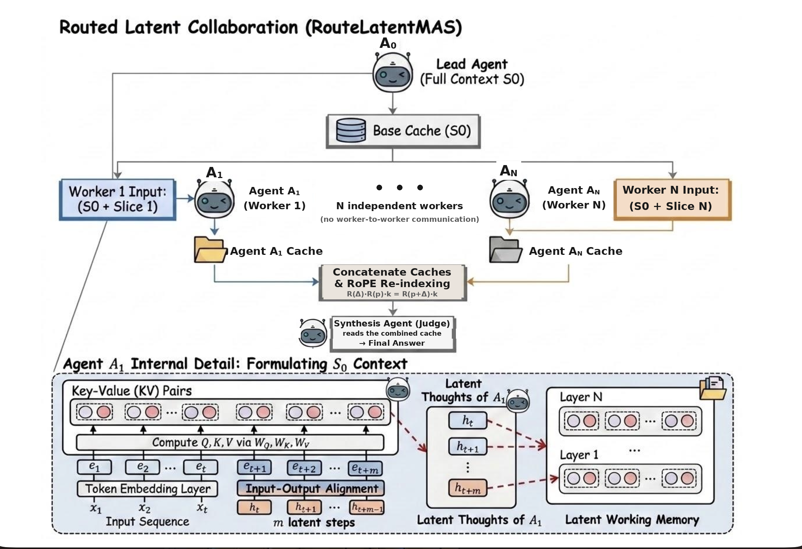

# Routed LatentMAS

A fork of [LatentMAS](https://github.com/Gen-Verse/LatentMAS) that adds **routed fan-out**: instead of every agent working from the same context, a lead agent splits the task and gives each worker a different slice, runs them in parallel, and combines their results for a final answer — all through the models' KV caches, never through text.

<p align="center">
  
</p>

## Why skip the write-up

When a team of agents solves a problem the usual way, each one researches its piece, writes an English summary, and hands that summary to the next. It works, but the write-up is the bottleneck. Most of what a model holds right after reading — the connections it just made, the half-formed hunches, the context around them — never survives being compressed into a few sentences. Every handoff flattens a rich internal state into prose and forces the next agent to rebuild its understanding from the condensed version. Thought becomes English becomes thought, and information leaks at each conversion.

Routed LatentMAS removes that step. Each worker builds its internal working memory as it reads its slice, and the judge inherits that memory directly instead of a written report. The judge never reads a summary of the research; it picks up where each worker's mind left off, all at once. The effect is close to a hive mind: every worker reads its own segment deeply and in parallel, and one mind ends up holding all of it as if it had done the whole research itself — full context kept, nothing flattened into prose along the way.

## How agents communicate through the KV cache

When a transformer reads text, it builds a **key/value (KV) cache**: the stored attention state for every token it has processed. This is the model's working memory of the context. LatentMAS's core idea is that agents can hand this cache to each other directly instead of writing and re-reading text — agent B is given agent A's KV cache and attends to it as if it had read A's context itself. No serialization to text, no re-reading; the reasoning stays in latent space.

Base LatentMAS threads a **single** KV cache down a fixed chain of agents. Each agent inherits everything the previous ones accumulated, so they all reason from the same, growing context.

## What this fork changes

Routed LatentMAS gives each worker only the part of the context it needs:

1. **Lead** reads the shared context once, producing a base KV cache `S0`.
2. **Fan out** — each worker gets its own copy of `S0` plus a different sub-task, and runs **in parallel**. The workers never see each other. Each one produces a small KV block: its reasoning over its own slice.
3. **Append the caches** — the workers' KV blocks are concatenated onto `S0` into one combined cache, and a **judge** decodes the final answer over the whole thing at once. The judge attends to every worker's latent work simultaneously, without re-reading any text.

This turns the chain into a genuine parallel decomposition — the latent analogue of map-reduce: workers map over disjoint slices, the judge reduces. It only makes sense for tasks that actually split (e.g. comparison questions over two separate entities), which is what the fork targets.

## Why appending the caches takes care

Each worker built its cache starting right after `S0`, so every worker's tokens think they live at the same positions. Concatenate them naively and those positions collide — the judge's attention reads them out of order and the answer is garbage.

So before appending, each worker's block is **re-indexed**: its rotary position encoding (RoPE) is re-rotated to the block's real offset in the combined sequence. This is a cheap, exact rotation — no recomputation — and it makes the concatenation read as one correctly-ordered sequence.

**The formula.** RoPE encodes a key's position by rotating it: a key first computed at position $p$ is stored as $R(p)\,k_0$, where $R(p)$ is the rotary rotation for that position. Rotations of this form compose additively, so

$$R(\Delta)\,R(p)\,k_0 = R(p+\Delta)\,k_0.$$

That identity is the whole trick: left-multiplying an already-rotated cached key by $R(\Delta)$ moves it from position $p$ to $p+\Delta$ **without re-running the model**. Concretely, using the model's own rotary frequencies $f$ and the shift angle $\theta = \Delta f$, the re-indexed key is

$$k' = k \odot \cos\theta \; + \; \mathrm{rotate\_half}(k) \odot \sin\theta.$$

Each worker $w$ is shifted by $\Delta_w$ = the combined length of all workers placed before it, which drops every block at its true offset in the stitched sequence. Values carry no positional phase, so they are left untouched. (`--no_reindex` turns the shift off, to measure that it matters.)

## Running it

```bash
git clone -b routed-mas https://github.com/JoshBong/LatentMAS.git && cd LatentMAS
pip install -r requirements.txt

# routed fan-out on comparison questions (2 disjoint entities -> 2 workers)
python run.py --method routed_mas --model_name Qwen/Qwen3-4B --task hotpotqa --num_workers 2
```

For comparison: `--method baseline` (one agent, full context) and `--method latent_mas` (the base chain).

## Credit

Fork of [LatentMAS](https://github.com/Gen-Verse/LatentMAS) (Zou et al., 2025), *Latent Collaboration in Multi-Agent Systems*, [arXiv:2511.20639](https://arxiv.org/abs/2511.20639). The routed method, KV-cache operations, and router are additions of this fork.
